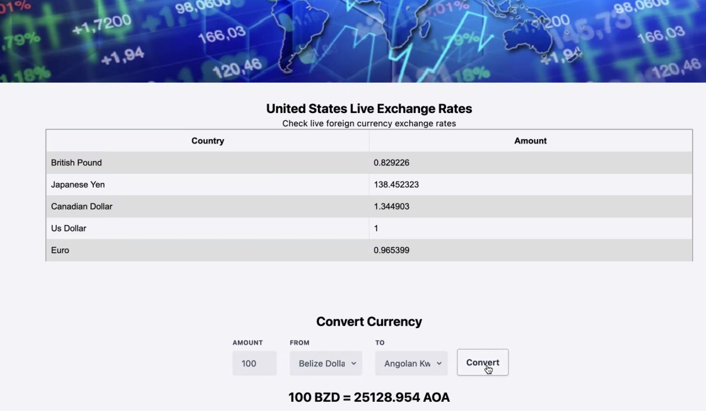

# 07 Project 1: Interactive Front-End Application

Currency Converter Web Application 

## Project Requirements

* Use a CSS framework other than Bootstrap.

* Be deployed to GitHub Pages.

* Be interactive (i.e., accept and respond to user input).

* Use at least two [server-side APIs](https://coding-boot-camp.github.io/full-stack/apis/api-resources).

* Does not use alerts, confirms, or prompts (use modals).

* Use client-side storage to store persistent data.

* Be responsive.

* Have a polished UI.

* Have a clean repository that meets quality coding standards (file structure, naming conventions, follows best practices for class/id naming conventions, indentation, quality comments, etc.).

* Have a quality README (with unique name, description, technologies used, screenshot, and link to deployed application).

## Description
 * Currency converter, country location and live exchange rate table

## Technologies

* tailwind

* exchange rate

* ipapi 

## Api Websites

* https://exchangerate.host/#/

* https://ipapi.co/

## Github and Deployed

* https://khinoj.github.io/super-team-project/

* https://github.com/khinoj/super-team-project

## Screenshot

### Presentation

* Google slide presentation

* (https://docs.google.com/presentation/d/15n5FlfDGQ4euJulLPmqWjDaxLdiUroUbcnK5zeWllXg/edit#slide=id.g19cd5f26207_2_18g).

## License

MIT License